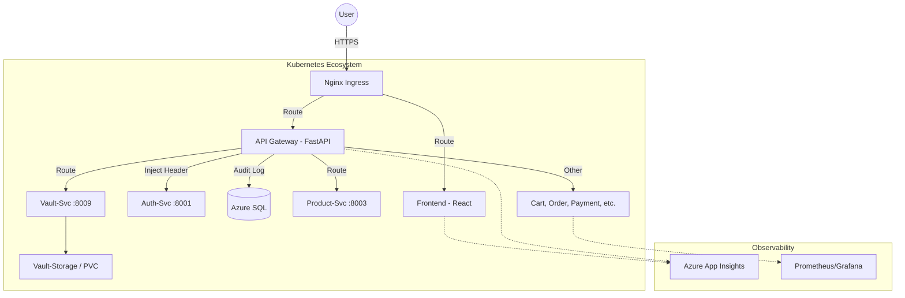

# 🛒 StreamShop: Elite Microservices E-Commerce Ecosystem

[](https://azure.microsoft.com/en-us/services/monitor/)
[](https://kubernetes.io/)
[](https://fastapi.tiangolo.com/)
[](https://reactjs.org/)

**StreamShop** is a production-grade, distributed e-commerce platform featuring a Netflix-inspired UI and a high-performance microservices backend. This project showcases state-of-the-art patterns in **Cloud Native** development, **Distributed Tracing**, and **Autonomous Scaling**.

---

## 🏗️ Elite Architecture Overview

The system is composed of **10 specialized microservices** orchestrated via Kubernetes, ensuring independent scalability and failure isolation.

### The "Life of a Request" Flow
In a technical interview, we describe the system through its dynamic flows:

1.  **Entry Point**: Traffic hits the **Nginx Ingress** on host `shop.local`.
2.  **Stateless Gateway**: The **API Gateway (FastAPI)** intercepts the request, validates the **JWT**, and performs **Context Injection** (injecting the `X-User-Email` header for downstream services).
3.  **Background Audit**: Every request is logged via an asynchronous background task to the **AuditLog table** without blocking the main request path.
4.  **Distributed Trace**: Using **Application Insights & OpenTelemetry**, a single Trace ID follows the request from the React Frontend to the SQL Database.
5.  **Service Resolution**: Request is routed to the target service (e.g., `vault-service:8009`) using internal K8s DNS.
6.  **Persistence Layer**: Data is persisted in **Azure SQL**, while binary files (Vault) are stored in **Kubernetes Persistent Volume Claims (PVC)**.

---

## ✨ Features (The "Wow" Factors)

- **🎬 Netflix-Style Discovery**: Cinematic product catalog with hover-to-play video trailers powered by YouTube CDN.
- **🛰️ Full-Stack Observability**: Integrated telemetry using **Azure App Insights** (via `telemetry.js` and OpenTelemetry) and **Prometheus** metrics.
- **🛡️ Security Triad**: 
    - **Identity**: Stateless JWT-based authentication.
    - **traceability**: Centralized API Audit Logging.
    - **Isolation**: Physical directory-based file isolation in the Vault PVC.
- **⚙️ Self-Healing Core**: Liveness/Readiness probes ensure traffic only hits healthy pods, with automatic restarts on failure.
- **🚀 Autonomous DB**: Real-time schema synchronization (Auto-Migrations) built into every service.

---

## 🛠️ Tech Stack & Patterns

| Layer | Technologies | architectural Patterns |
| :--- | :--- | :--- |
| **Frontend** | React (Vite), Tailwind, App Insights SDK | Component-Based UI, SPA, Client-Side Telemetry |
| **API Layer** | FastAPI, httpx, AsyncIO | **API Gateway Pattern**, Proxying, Background Tasks |
| **Compute** | Docker, Kubernetes (AKS) | Containerization, Pod Autoscaling (HPA) |
| **Data** | Azure SQL, PVC (Azure File Share) | **Database-per-Service** (Logical Isolation) |
| **Monitoring** | Prometheus, Grafana, OpenTelemetry | **Distributed Tracing**, Metric Aggregation |

---

## 📂 System Topology



---

## 🚀 Deployment Guide

### 1. Requirements
- Azure Kubernetes Service (AKS) or Local K3s/Minikube.
- Azure SQL Instance or MSSQL Container.
- Azure Storage Account (for PVC).

### 2. Implementation
```bash
# 1. Build and push microservices
docker build -t your-registry.azurecr.io/api-gateway:v1 ./services/api-gateway
docker push your-registry.azurecr.io/api-gateway:v1

# 2. Apply K8s Configurations
kubectl apply -f k8s/deployments-fixed.yaml
kubectl apply -f k8s/ingress.yaml
```

---

## 📈 Monitoring & Maintenance

- **Health Checks**: Access `/health` on any service to verify its internal state.
- **Metrics**: Prometheus scrapes all services on port `800x/metrics`.
- **Logs**: Use `kubectl logs -f deployment/stream-api-deploy` for real-time Gateway audit viewing.

---

## 🤝 Developed by
**[Puneet Kumar](https://github.com/Puneet-K-Sharma)**  
*Crafting scalable, cloud-native distributed systems.*
